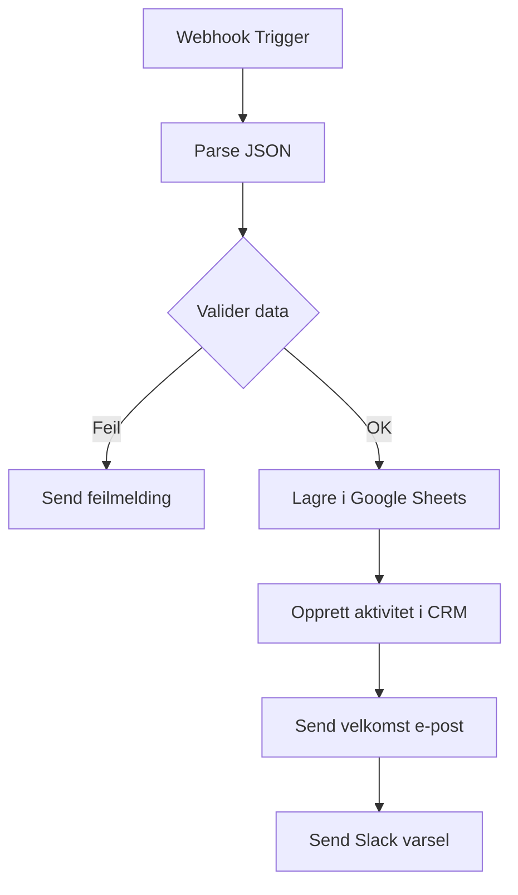

# 5 Viderefakta for Automatiseringsjobben (Dybdeperspektiv)

---

## 6. Eksempel: Full Setup av En Automatisert Lead Form

Her er hvordan du faktisk setter opp en automatisert lead capture:

### Steg 1: Create n8n Workflow


### Steg 2: Webhook Trigger
- Type: Webhook
- Method: POST
- URL: `https://din-n8n.no/webhook/ny-lead`
- Dette er knappen "Send request" på formen

### Steg 3: Trinn for trinn

**Trinn 1: Receive Webhook**
- Få data fra formen
- Eksempel-data:
  ```json
  {
    "navn": "Ola Nordmann",
    "e-post": "ola@example.com",
    "telefon": "912 34 567",
    "bedrift": "ABC AS",
    "erdeg" Foretak": true
  }
  ```

**Trinn 2: Check Required Fields (Code Node)**
```javascript
const data = $input.all();

// Tjekk om påkrevde felt er fylt
if (!data[0].json.navn || !data[0].json.e-post) {
  return [{ json: { status: 'error', message: 'Mangler navn eller e-post' } }];
}

// Hvis OK, fortsett
return [{ json: { status: 'ok', data: data[0].json } }];
```

**Trinn 3: Lagre i Google Sheets (Google Sheets Node)**
- Tabell: `Leads`
- Skriv til: `A1:B1` (basered på header-positon)
- Headers: `Navn`, `E-post`, `Telefon`, `Bedrift`, `Er deg Foretak`

**Trinn 4: Opprett Aktivitet i CRM (Webhook Node til HubSpot)**
```json
{
  "fields": [
    {
      "objectTypeId": "0-1",
      "name": "email",
      "value": "ola@example.com"
    },
    {
      "objectTypeId": "0-1",
      "name": "firstname",
      "value": "Ola"
    },
    {
      "objectTypeId": "0-1",
      "name": "lastname",
      "value": "Nordmann"
    }
  ]
}
```

**Trinn 5: Send Velkomst E-post (Gmail eller SendGrid)**
- Template: "Velkommen {navn}!"
- Mottaker: `{e-post}`
- Trigges automatisk etter at lead er lagret

**Trinn 6: Slack Varsling**
- Kanal: `#nye-leads`
- Message: "Ny lead: {navn} fra {bedrift}"
- Send til salgs-teamet umiddelbart

---

## 7. Funksjoner du MÅ kjenne til

### Wait Node (Vent Node)
- Holder workflowet i live i X minutter
- Nyttig for å checke om noen endret seg
- Eksempel: Vent 10 minutter, så sjekk om status er endret

### Switch Node (Velg Node)
- Brukes til å velge ulike stier
- Eksempel: Hvis `bedrift` = "ja" → Send til salags-team, ellers → Send til support
- Kan sette opp betingelser: `field === 'verdi'`

### Google Sheets - Append Row (Legg til rad)
- Legger alltid til ny rad i bunnen
- Ikke overskriver eksisterende data
- Bruk hvis du vil bygge opp historikk

### Merge Node (Slå sammen)
- Slår sammen data fra flere kilder
- Eksempel: Få data fra n8n OG from CRM og slå dem sammen

---

## 8. Praktisk Eksempel: Automatisert Svar på E-post

Når en kunde sender en e-post til en spesifikk adresse, skal AI svare automatisk:

### Workflow Setup:
1. **Gmail Trigger** - "Når ny e-post i mappen 'Support'"
2. **AI Message Node** (OpenAI) - Analyser e-posten
   - Send prompt: "Svar kort og hjelpsomt på denne e-posten"
3. **Check Sentiment** - Tjek om kunden er irritert
   - Hvis irritert → Høy prioritet
4. **Slack Notify** - Send til support-team
5. **Reply to Email** - Svar automatisk (alternativ)

### AI Node Setup:
- Model: GPT-4 (eller billigere model for simple spørsmål)
- System prompt: "Du er en hjelpsom support-agent"
- Temperature: 0.7 (nøyaktig, men variert)
- Max tokens: 100 (kort svar)

---

## 9. Feilsøking og Logging - Praktisk Guide

### Hva å se etter i logger:
1. **404 Not Found** - Feil URL eller API-endpoint
2. **401 Unauthorized** - Feil API key eller auth
3. **500 Internal Error** - Server-side feil
4. **Rate Limit** - For mange requests til API-et

### Vanlige problemer og løsninger:

**Problem:** Workflow kjører ikke
- Løsning: Tjek at webhook er aktivt og URL er riktig

**Problem:** Data kommer ikke inn
- Løsning: Sjekk JSON-formatet i webhook-trinnet
- Bruk "Test" button på webhook-trinnet for å se hva som kommer inn

**Problem:** Google Sheets skriver feil celle
- Løsning: Tegn opp tabellen i Excel først, merk header-posisjoner

**Problem:** API giver feilmelding
- Løsning: Check dokumentasjon for API-ten
- Tegn opp URL, headers og body for test

---

## 10. Best Practices for Store Automatiseringsløsninger

### 1. LAG OG TEST GRUNNLAGET FØRST
- Sett opp Google Sheets som database
- Test API-tilkoblingen til eksisterende systemer
- Bygg workflowen steg-for-steg, test hver gang

### 2. BRUK HENDELESHANDELIG LOGIKK
- Når X skjer → Gjør Y
- Ikke prøv å gjøre alt i én giant workflow
- Del opp i små, rene prosesser

### 3. DOKUMENTER ALT
- Lag "Schemata" for dataformater
- Lag notater for hver workflow
- Lag en "How-to" guide for hver løsning

### 4. TEST, TEST, TEST
- Test med falske data før du sender til kunder
- Test backup-løsninger (hvis n8n feiler)
- Hvorfor fungerer dette?

### 5. OVERVÅK OG FORDELE
- Se hvor mange leads/prosesser du får
- Oppdater workflows basert på feedback
- Spor kostnader og ROI

---

### Praktisk Setup Checklist:
- [ ] n8n deployet og tilgjengelig
- [ ] Google Sheets med headers (tabell opprettet)
- [ ] API-keys lagret (sikkert!)
- [ ] Test-workflow kjører med dummy data
- [ ] Logg-system klar
- [ ] Backup-strategi (copy av sheets, loggfiler)
- [ ] Support-plan (hvem hjelper når det går galt)
- [ ] Dokumentasjon opprettet
- [ ] Opplært brukere (Anders)
- [ ] Monitoring (slack varslinger ved feil)

---

### Neste steg:
1. Start med én enkel workflow (f.eks. lead form)
2. Forstå hver del før du bygger mer
3. Bygg opp systemet gradvis
4. Skriv alt ned i dokumentasjon

**Bygg ikke på et hull! Start med en solid grunnmurf.**
